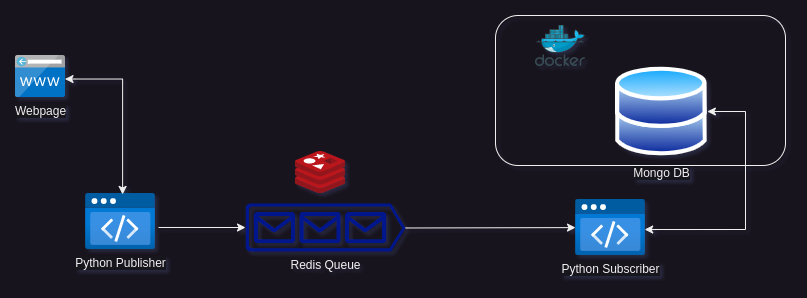
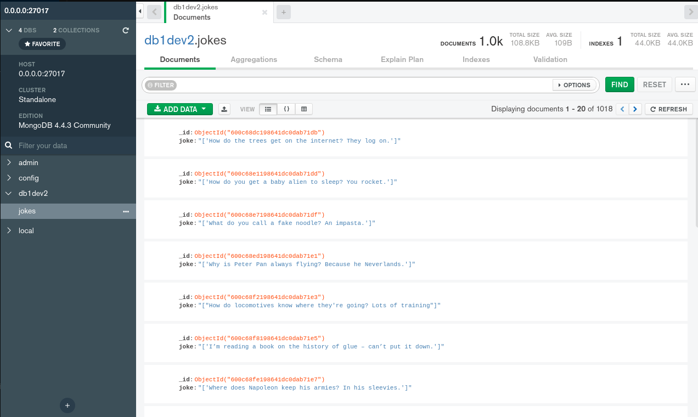

# python-redis-mongo

Redis is mostly a cache storage widely used in multiple services, but it can be also used as a Message Broker.

This project aims to show how to use Redis database hosted in Heroku as a message queue together with Python and MongoDB.

## Flow description:

1. Python publisher scrapes jokes from `https://icanhazdadjoke.com/` website and publishes them on Redis queue.
2. Subscriber listens to the queue and inserts messages into MongoDB.



> **Warning**
Linux only!

### Install & Config Redis

Once Heroku account is ready, you can attach a database engine (Redis) to be able to use it for further projects. To do so, you need to install Redis addon. After successfull installation, you should have a host URL, port and password to access database.

1. Install Heroku on your local machine

```bash
sudo snap install --classic heroku
```
Log in into Heroku using your browser

```bash
heroku login

>> heroku: Press any key to open up the browser to login or q to exit: 

- press any key and go to the browser
```
Install Redis addon (Free version)

```bash
heroku addons:create heroku-redis:hobby-dev -a redis-dev1
```

### Install & Config MongoDB

```bash
wget -qO - https://www.mongodb.org/static/pgp/server-4.4.asc | sudo apt-key add -

sudo apt-get install gnupg
```

For Ubuntu 20:

```bash
echo "deb [ arch=amd64,arm64 ] https://repo.mongodb.org/apt/ubuntu focal/mongodb-org/4.4 multiverse" | sudo tee /etc/apt/sources.list.d/mongodb-org-4.4.list
```

For Ubuntu 20<:

```bash
echo "deb [ arch=amd64,arm64 ] https://repo.mongodb.org/apt/ubuntu bionic/mongodb-org/4.4 multiverse" | sudo tee /etc/apt/sources.list.d/mongodb-org-4.4.list
```

```bash
sudo apt-get update

sudo apt-get install -y mongodb-org
```

You can also use Docker image

```bash
sudo docker pull mongo
sudo docker run -d -p 27017-27019:27017-27019 --name mongodb mongo:latest
```

To check Mongo container ID you need to execute the following command that returns all active/inactive containers.

```bash
sudo docker ps -s
```

To run Mongo Docker container you can use the whole container id or the first few characters.

```bash
sudo docker start xyz   # assumming the container id starts from xyz..
```

Since now, the MongoDB is available under 27017 port.


> **Note**
Compass is a good graphical interface for MongoDB, you can install it using the following commands:

```bash
wget https://downloads.mongodb.com/compass/mongodb-compass_1.25.0_amd64.deb

sudo dpkg -i mongodb-compass_1.25.0_amd64.deb

mongodb-compass

```

## Launch system

1. Run python subscriber.

Python subscriber listens to all messages being published on '*-channel' channels.

```bash
python subscriber.py
```

2. Run python publisher.

Python publisher scrapes jokes (messages) from website and publishes them on 'test-channel' channel.

```bash
python publisher.py
```

Since now the publisher scrapes messages in every 2 seconds and publishes them on Redis, whereas subscriber listens to new messages published by publisher, consumes them and loads into MongoDB.

The results are available in Mongo/Compass

